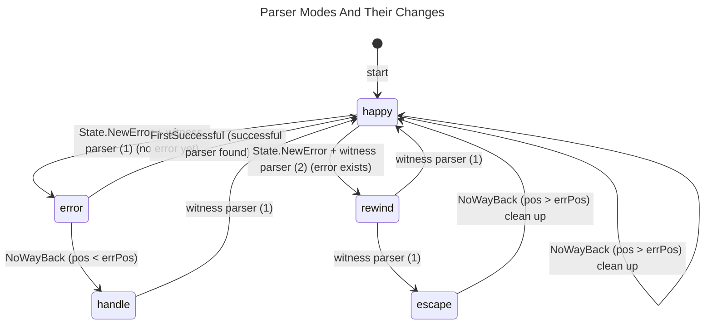
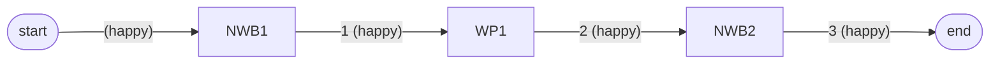
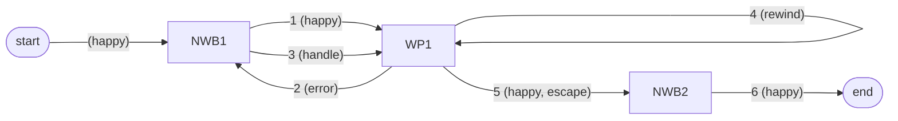
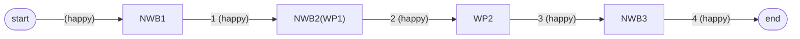
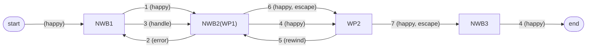
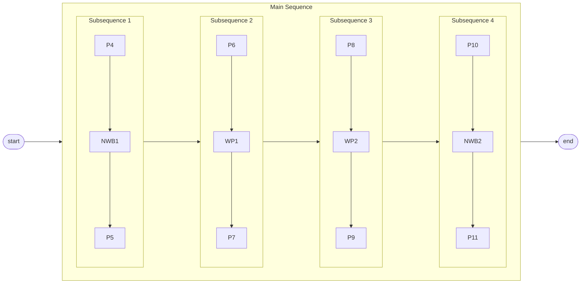
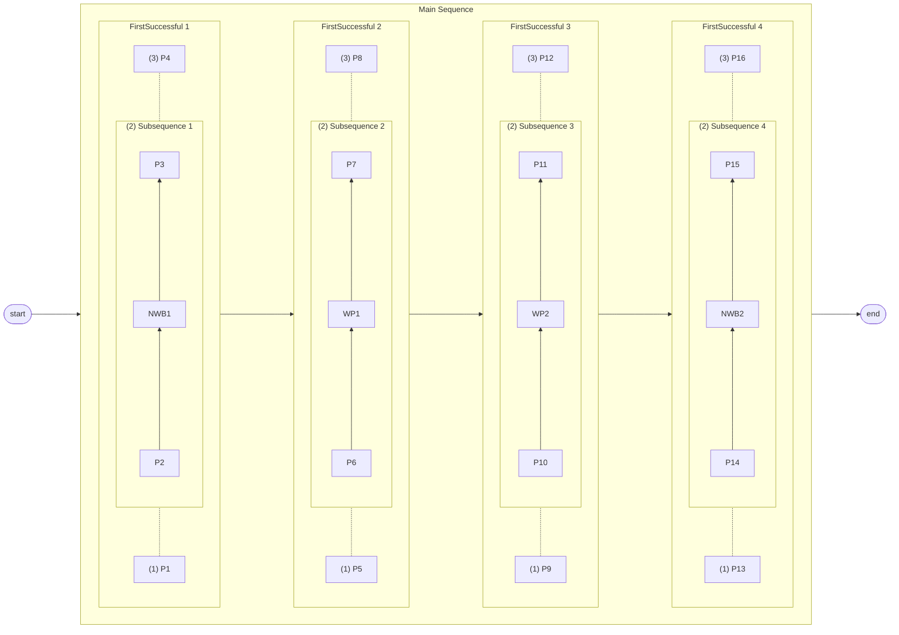

# Error Handling

The handling of (syntax) errors is the by far hardest part of this project.
I had to refactor the project **three** times to get it right and
almost made a PhD in computer science understanding all those
scientific papers about error handling in parsers
with their extremely concise notation that is explained nowhere
because it is the well known standard in the field.
Thank you, Sérgio Medeiros and Fabio Mascarenhas, for your paper
[Syntax Error Recovery in Parsing Expression Grammars](https://dl.acm.org/doi/10.1145/3167132.3167261).
That brought me on the right track.
And thank you, Terence Parr and [ANTLR](https://www.antlr.org/),
for an OpenSource parser to compare against.
I would have switched to it if I had found the Go support of ANTLR early enough.

So please take some time to understand this before making or suggesting
any major changes.

The error handling consists of error reporting and recovering from errors.

## Error Reporting

Syntax errors are always reported in the form:
> expected "token" [line:column] source line incl. marker ▶ at error position

Programming errors (in one of Your parsers) are always reported in the form:
> programming error: message [line:column] source line incl. marker ▶ at error position

Semantic and miscellaneous errors are always reported in the form:
> message [line:column] source line incl. marker ▶ at error position

Calculating the correct line and column of the error and setting the marker
correctly are the hardest problems here.
And they bring the most benefit to the user.

## Recovering From Errors

In general, we distinguish between simple **leaf** parsers that don't use
any sub-parsers and **branch** parsers that do use one or more sub-parsers.

For recovering from errors the parser uses a minimal set of modes. \
Great care has to be taken by all branch parsers because we not only
have to find a safe point to recover to, but also have to have the correct
Go call stack to be able to parse correctly after recovering.
Furthermore, we need to use the parsers more often than other (e.g. LR-) parsers. \
This is a downside of all parser combinators.
We mitigate it with some helpers and by caching as much as reasonable.

The `NoWayBack` parser plays a key role in error recovery.
It is the one to conclude that an error has indeed to be handled
(if its position is before the error),
and it also marks the next safe state to which we want to recover to
(if its position is behind the error). \
A `NoWayBack` parser at the exact error position isn't of help
for that particular error. \
Finally, the `NoWayBack` parser is used to prevent the `FirstSuccessful` parser
from trying other sub-parsers even in case of an error.
This way we prevent unnecessary backtracking.

So please use the `NoWayBack` parser as much as reasonable for your grammar!
As it keeps the backtracking to a minimum, it also makes the parser perform better.

The `FirstSuccessful` and `NoWayBack` parsers are special **branch** parsers. \
In general, it's true that **all** branch parsers have to deal a lot with
error recovery. But we have you covered, because the base parsers
`FirstSuccessful`, `Sequence`, `MapN` and `ManyMN` are all doing the hard work
for you. \
As long as you are able to build your own branch parser on them
(directly or indirectly), care is already taken. \
`Map`, `Map2`, `Map3`, `Map4`, `Map5`, `Prefixed`, `Suffixed`, `Delimited`,
`Recognize`, `Optional` and `Assign` all build on `MapN`. \
`Count`, `Many0` and `Many1` are built on `ManyMN`. \
`SeparatedMN`, `Separated0` and `Separated1` are based on `ManyMN` and `MapN`.

All other parsers in the `pcb` package are leaf parsers that don't need to
care about error handling.

The following sections define the modes and their relationships in detail.

### Parser Modes

These are the modes:

##### happy:
Normal parsing discovering and reporting errors
(with `State.NewError` or `State.ErrorAgain` for cached results). \
The error will be witnessed by the immediate parent branch parser.

If we happen to handle an error and hit a `NoWayBack` parser then
we will be very happy to clean up. \
This means we were able to handle the error by modifying the input
and didn't have to use any `Resolverer`.

##### error:
An error was found but might be mitigated by backtracking and the
`FirstSuccessful` parser.
In this mode the parser goes back to find the last `NoWayBack` parser or
trying later alternatives in the `FirstSuccessful` parser.

The previous `NoWayBack` parser might be hidden deep in a sub-parser
that is earlier in sequence but not on the Go call stack anymore.

So in this mode all parsers that use sub-parsers in sequence have to use them
in reverse order to find the right `NoWayBack` parser. \
Funnily this also applies to parsers that use the *same* sub-parser
multiple times. So if the second time the sub-parser was used, failed
then it might very well be that the first (successful) time it applied
a `NoWayBack` parser. And that would be the right one to find.

Only the `FirstSuccessful` parser (not as parent parser but as sibling this time)
is different. It has to find the first successful sub-parser and
its `NoWayBack` parser again. \
As parent parser (if the **error** mode is switched to while trying alternatives)
it can just try another alternative (normal **happy** mode behaviour).

##### handle:
We now know that the error found has to be handled.
We find the exact position and witness parser again by simply parsing
one more time (forward) in the new mode (possibly omitting any semantics).

The witness parser should
1. modify the input (respecting `maxDel`),
2. switch to **happy** mode and
3. parse again (possibly omitting the failing parser).
4. switch to **escape** mode if everything else fails.

##### rewind:
We failed again and have to try again with more deletion or
without using the parser that failed originally.

So we have to go backward similar to the **error** mode.
But with the distinction that we aren't looking for a `NoWayBack` parser
before the error position, but instead for the immediate parent branch parser of
the failing leaf parser that witnessed the error.

##### escape:
All deletion of input and inserting of good input didn't help.
Now we are out of options and can just escape this using a `Resolverer`.

So we find the best (least waste) `Resolverer` and its `NoWayBack` parser
executes it and finally cleans up and switches back to **happy** mode. \
The best `Resolverer` to use can't be determined statically,
because it depends on the input.

### Parsing Directions Per Mode

The direction of parsing changes with the mode.
Normal parsing is forward of course but in some other modes we have to move backward.
Here is the full table:

|   Mode | Direction                                      |
|-------:|:-----------------------------------------------|
|  happy | forward (until a failure is witnessed)         |
|  error | **backward** (to the **previous** `NoWayBack`) |
| handle | forward (to the `witness parser (1)`)          |
| rewind | **backward** (to the `witness parser (1)`)     |
| escape | forward (to the (best) **next** `NoWayBack`)   |

So the parsers move only in the **error** and **rewind** modes backward,
and forward in all other modes.

### Relationships Between Modes

The relationships between the modes are shown in the following
state diagram.
The diagram also shows where a mode change can happen and the condition
(next to the mode) that has to be fulfilled for the change.

The position of the error is shortened to `errPos`. \
The first parent branch parser to witness the error to be handled
is called `witness parser (1)`. \
A possibly different parent branch parser to witness an error
during handling of the first is called `witness parser (2)`.

Next we will look at the changes in modes that are possible within sub-parsers.

### Possible Mode Changes

The following table lists the mode changes that are possible in a leaf or
branch sub-parser.

The `NoWayBack` parser and the `witness parser`s can only have leaf parsers
as sub-parser. Every other branch parser can also have branch parsers as
sub-parsers.

The first column shows the mode the parent parser is in,
the second column the possible modes

|    At Start | After Leaf Parser | After Any Branch Parser | After Searched Parser |
|------------:|:------------------|:------------------------|:----------------------|
|  happy (>>) | happy, error      | happy, error, escape    | not searching         |
|  error (<<) | error             | error, handle           | handle                |
| handle (>>) | handle            | handle, happy, escape   | happy, escape         |
| rewind (<<) | rewind            | rewind, happy, escape   | happy, escape         |
|  escape(>>) | escape            | escape, happy           | happy, escape         |

The last column is the most important for the implementation since we often know
the exact parser we are searching from the cache.
In those cases an entry of 'happy, escape' means:

- `happy`: Error recovery has been successful.
           Parse normally again starting with the next (sub-)parser.
- `escape`: Use the (best of the) next `Resolverer`(s) to escape the mess.
            Only `NoWayBack-Resolverer`s from later (sub-)parsers must be
            considered. Sequential parsers only consider one `Resolverer`.

So all parsers working sequentially that really do error handling
(`Sequence`, `MapN` and `MultiMN`) have to have a `startIdx` parameter
for modes `happy` and `escape` to be able to use only later sub-parsers.

The following sections detail some error recovery scenarios.

### Example Scenarios Or Error Recovery

Before we can dive into the scenarios themselves we have to define
a few abbreviations (or the diagrams would go beyond the screen).

- `Px`: any parser with no special role (`x` being a decimal number), e.g.: `P7`
- `NWB`: a `NoWayBack` parser wrapping any leaf parser
- `NWB3`: up to three `NoWayBack` parsers might be involved in a complex scenario
- `WP1`: `witness parser (1)` witnessing any sub-parser; it's the error handling parser
- `WP2`: `witness parser (2)` witnessing any sub-parser; it just witnesses a secondary error
- `FS`: a `FirstSuccessful` parser
- `FSx`: the `FirstSuccessful` parser number `x` (`x` being a decimal number), e.g.: `FS3`
- `parser(mode)`: the parser is in a certain mode, e.g.: `WP1(handle)`
- `parser(mode1, mode2)`: multiple possible modes are separated by a comma (','),
  e.g.: `WP2(error, rewind)`
- `NWB(parser)`: the `NoWayBack` parser wraps a parser, e.g: `NWB(other parser)`

A complex example is: `NWB(WP1(happy, handle))` meaning a `NoWayBack` parser
that also acts as `witness parser (1)` that is either in mode `happy` or
in mode `handle`.

We will use flow diagrams for the scenarios and the links between the nodes
show the order and potentially modes in parentheses.

#### Simple Sequence

The simple sequence scenario looks like this if nothing fails:

If `WP1` fails it will look like this:

The last step can be in mode `happy` if the error could be resolved by deletion or insertion.
It will be in mode `escape` if we have to use the `Resolverer` of `NWB2`.

#### Simple Sequence With Three `NoWayBack`s

A slight complication of the sequence above is the following (without failure):

If `WP1` fails it will look like this:

The last two steps can be in mode `happy` if the error could be resolved by deletion or insertion.
It will be in mode `escape` if we have to use the `Resolverer` of `NWB2`.

So this scenario is **really** the same as the most simple one above.
It mainly illustrates that the `NoWayBack` parser 2 (`NWB2`) isn't of any help
but only serves as `witness parser (1)` in this scenario.
And the error recovery is (sometimes) failing at the witness parser (2) (`WP2`).

#### Cascading Sequences

In this scenario all parts involved are distributed over different
sequence like parsers (parsers base on `Sequence`, `MapN` or `MultiMN`).

The important thing to note about this much more complex scenario is that all
the `Px` parsers play no active role in the game.
They don't change the mode or perform any kind of error handling.

They only pass on the state in the right direction (according to the parsing mode)
and possibly advance the position in the input.
The position in the input is **the** crucial thing here.
If that isn't handled perfectly, all caching will miss, and the parser
is **broken**.

#### Cascading Sequences With `FirstSuccessful` Parser

In this scenario all parts involved are inside different `FirstSuccessful` parsers.
The alternative sub-parsers of the `FirstSuccessful` parser are connected by
dotted lines and the alternatives are numbered in parentheses in the order
they are tried.

The important thing to note here is that the `FirstSuccessful` parser should
evaluate and choose between alternatives only in **happy** mode.

In modes **error**, **handle** and **rewind** it has to use the exact same
alternative as before. \
And in **escape** mode it has to choose the best of potentially multiple
`NoWayBack` parsers and their `Recoverer`s.