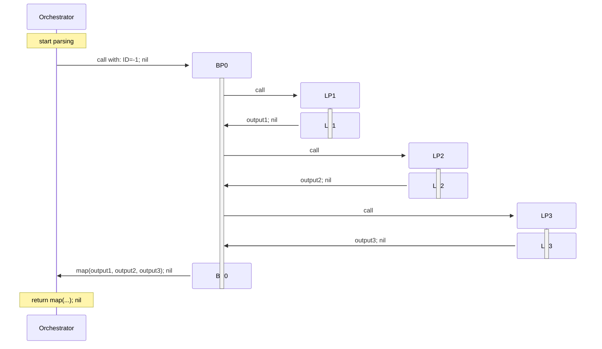
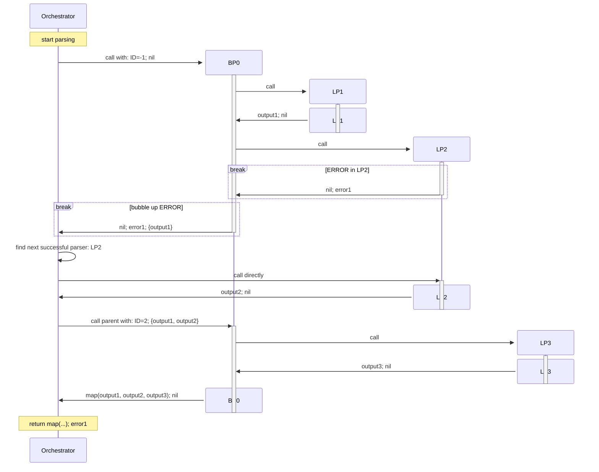
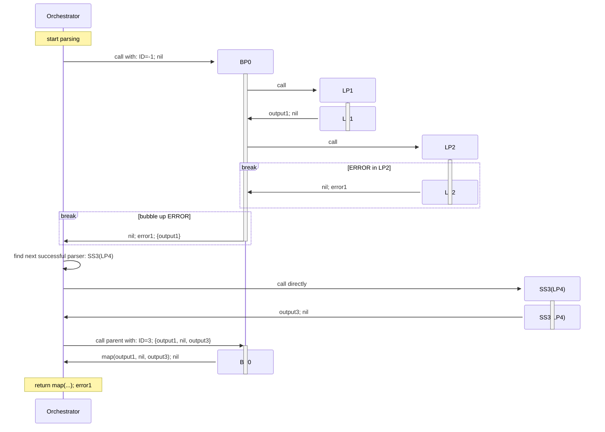
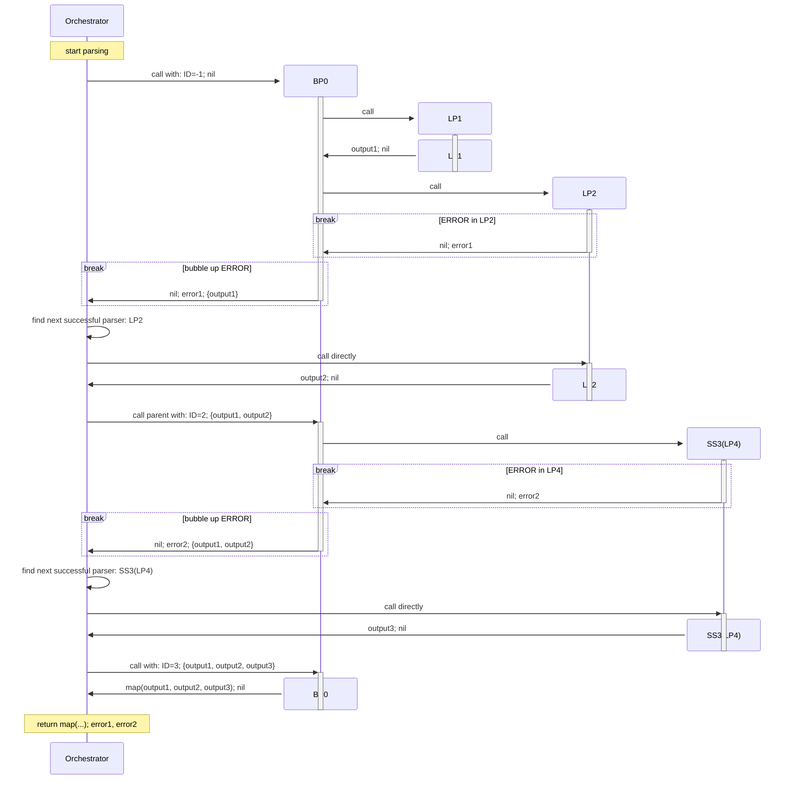

# Error Handling

The handling of (syntax) errors is the by far hardest part of this project.
I had to refactor the project **four** times to get it right and
almost made a PhD in computer science understanding all those
scientific papers about error handling in parsers
with their extremely concise notation that is explained nowhere
because it is the well known standard in the field.
Thank you, Sérgio Medeiros and Fabio Mascarenhas, for your paper
[Syntax Error Recovery in Parsing Expression Grammars](https://dl.acm.org/doi/10.1145/3167132.3167261).
That brought me on the right track.
And thank you, Terence Parr and [ANTLR](https://www.antlr.org/),
for an OpenSource parser to compare against.
I would have switched to it if I had found the Go support of ANTLR early enough.

So please take some time to understand this before making or suggesting
any major changes.

The error handling consists of error reporting and recovering from errors.

## Error Reporting

Syntax errors are always reported in the form:
> expected "token" [line:column] source line incl. marker ▶ at error position

Semantic and miscellaneous errors are always reported in the form:
> message [line:column] source line incl. marker ▶ at error position

Calculating the correct line and column of the error and setting the marker
correctly are the hardest problems here.
And they bring the most benefit to the user.

### Binary Input

For binary input the message including prefix (`expected`)
stay exactly the same but the source and position part changes to:
> message:
>  00000002  6e 74 65 6e 74 0a 6c 69  ▶6e 65 32 0a 6c 69 6e 65  |ntent.li▶ne2.line|

So it's reported in the canonical hex+ASCII display format of the
UNIX `hexdump` command (`hexdump -C` to be exact).
The first number is the offset of the first byte displayed.
And it is in **hex** format!

### Panics

All panics are documented at the individual parsers, and they will only happen
during parser construction.
They always signal a programming error on your side.
No panic is ever done during the actual parsing.

## Recovering From Errors

In general, we distinguish between simple **leaf** parsers that don't use
any sub-parsers and **branch** parsers that do use one or more sub-parsers.

Leaf parsers still can make use of other leaf parsers internally.
But the whole parser (tree) will be considered as one leaf parser by
the rest of the parsing system.
So it is impossible to use one of those internal leaf parsers for error recovery.
As long as that is no concern, you can build complex leaf parsers from simple ones.

For recovering from errors the parser uses `SafeSpot` parsers and `Recoverer`s.

### SafeSpot parser

The `SafeSpot` parser plays a key role in error recovery.
It can be used with any **leaf** parser that **consumes input** and
turns it into a safe spot we might recover to.
It marks the next safe state to which we might want to recover to. \
And the `SafeSpot` parser is used to prevent the `FirstSuccessful` parser
from trying other sub-parsers even in case of an error.
This way we prevent unnecessary backtracking.

The full set of criteria for a `SafeSpot` parser is:
1. It's a leaf parser.
2. It always consumes some input.
3. It helps to find the correct context either for the
   `FirstSuccessful` parser or for recovering from an error.
 
So please use the `SafeSpot` parser as much as reasonable for your grammar!
It keeps the backtracking to a minimum, enables error recovery,
and it also makes the parser perform better.

### Recoverers
Recoverers help to find the next safe spot after an error occurred.
All parsers marked as `SafeSpot` parsers are asked for their recoverers.
The recoverer of the failed parser is added to the list
(to catch cases of added illegal input).
All recoverers are tried, and the one producing the least waste (unused input) is chosen.

The parser moves forward in the input according to the chosen recoverer and
calls the leaf parser belonging to the chosen recoverer.
This call should never fail (or the recoverer would have been wrong).

After that the parser tree is moved upward.
The parent parser of the now successful leaf parser is looked up and `parseAfterChild` is called.
This is done up the parser tree until the root parser has been successfully called or
another error is found.

#### Predefined Recoverers

The following recoverers are predefined.

##### cmb.Forbidden
Forbidden is the Recoverer for parsers that **must not** be used to recover at all.
These are all parsers that are happy to consume the empty input and
all look ahead parsers.

##### cmb.IndexOf
IndexOf searches until it finds a stop token in the input.
If found, the Recoverer returns the number of bytes up to the token.
If the token could not be found, the recoverer returns `comb.RecoverWasteTooMuch`.

This function panics during the construction phase if the stop token is empty.

##### cmb.IndexOfAny
IndexOfAny searches until it finds a stop token in the input.
If found, the recoverer returns the number of bytes up to the token.
If no stop token could be found, the recoverer returns `comb.RecoverWasteTooMuch`.

**Note:**
  - If any of the stop tokens is empty, it returns 0.
  - If no stops are provided, then this function panics during
    the construction phase.

### Predefined Branch Parsers

The `FirstSuccessful` and `SafeSpot` parsers are special **branch** parsers. \
In general, it's true that **all** branch parsers have to deal with
error recovery. But we have you covered, because the base parsers
`FirstSuccessful`, `MapN`, `SeparatedMN` and  `Expression` are all doing the hard work
for you. \
As long as you are able to build your own branch parser on them
(directly or indirectly), care is already taken. \
`Map`, `Map2`, `Map3`, `Map4`, `Map5`, `Prefixed`, `Suffixed`, `Delimited`,
`Recognize`, `Optional` and `Assign` all build on `MapN`. \
`Count`, `Many0`, `Many1`, `ManyMN`, `Separated0` and `Separated1`  are based on `SeparatedMN`.

All other parsers in the `cmb` package are leaf parsers that don't need to
care about error handling.

### Writing Own Branch Parsers

For implementing a branch parser you have to call the following function
from the `comb` package:
```go
func NewBranchParser[Output any](
    expected string,
    children func() []AnyParser,
    parseAfterChild func(childID int32, childResult ParseResult) ParseResult,
) Parser[Output]
```
The `expected` string is usually just the name of the branch parser.
It's only used for debugging and should never be seen by the user.

The `children` function returns a slice of all child parsers (leaf or branch parsers).
This is used by the error handling system to prepare all parsers by registering them
in a central registry and giving each its own ID. \
It is allowed to not return child parsers as long as they never fail
(e.g. because they don't have to consume input)
and they are no safe spot parsers.
A child parser consuming optional space is a good example.

The `parseAfterError` function is the heart of a branch parser and
performs the parsing itself.
It will be called with `err == nil` and a `childID < 0` if it should parse from the beginning.
This way you have to implement _only one_ function for parsing. \
The state to start own parsing with always is the `childResult.EndState`.
During normal parsing `err` will always be `nil` and the `childID` will always be `< 0`.
An `err != nil` or `childID >= 0` signals that error recovery is going on. \
The `parseAfterChild` function has to use a few functions and methods from the main parser package:
* Child parsers have to be called with:
    ```go
    func RunParser(ap AnyParser, parent int32, inResult ParseResult) ParseResult
    ```
  This ensures the correct handling of branch parsers.
* Partial output has to be saved by calling:
    ```go
    func (e *ParserError) StoreParserData(parserID int32, data interface{})
    ```
  This ensures that no parser output gets lost.
* If the `err != nil`, the partial output can be fetched with:
    ```go
    func (e *ParserError) ParserData(parserID int32) interface{}
    ```
  This gives the partial output saved with `StoreParserData` back.

So please follow these rules. They shouldn't restrict you in any way.
If your branch parser doesn't have any partial results to be saved,
you needn't use `StoreParserData` and `ParserData` at all.

Of course, you are welcome to use
`FirstSuccessful`, `MapN`, `SeparatedMN` or  `Expression` as a starting point.
They are intentionally defined in an own package separated from the main parser package,
just like yours.

### General Error Recovery

The recovery from errors is following these steps:

1. The error is returned to the main parser / orchestrator.
1. The orchestrator saves the error so it can return it later.
1. The orchestrator looks for the next successful (`SaveSpot`) parser
   (the parser with minimal waste using the `recoverer`s).
1. The orchestrator calls the parser found in the previous step.
1. The orchestrator calls its parent parser and all grandparent parsers
   upwards including the root parser.
1. If a new error is found in  the last two steps, the whole sequence starts again.

### Example Scenarios For Error Recovery

Before we can dive into the scenarios themselves we have to define
a few abbreviations (or the diagrams would go beyond the screen).

- `main`: the main parser orchestrating everything else.
- `LPx`: leaf parser with ID `x` (`x` being a decimal number), e.g.: `LP1`
- `LPx(2)`: leaf parser with ID `x`, second call, e.g.: `LP1(2)`
- `BPx`: branch parser with ID `x`, e.g.: `BP0`
- `BPx(2)`: branch parser with ID `x`, second call, e.g.: `BP0(2)`
- `SSx`: a `SafeSpot` parser with ID `x` wrapping any leaf parser
- `SSx(parser)`: the `SafeSpot` parser with ID `x` wraps a parser, e.g: `SS2(P3)`

We will use Git graph diagrams for the scenarios and "branches" will be the parsers
calling each other.
The first "commit" in each "branch" shows what a branch parser is called with
(ID and former partial output) and the last shows what it returns
(output; error; partial output (in case of a branch parser)).
In the case of a leaf parser or the main orchestrating parser it's just the output and error.

#### Good Case

The simple sequence scenario looks like this if nothing fails:



All parsers except the orchestrator are marked as active when they run.
This is necessary because they are called multiple times in error cases.
They aren't running at all during the inactive times,
as you can see in the next example.

#### Simple Error Case 1

If `LP2` fails because of an illegal additional character, it looks like this:



If an error happens, the main parser and orchestrator is looking for the next successful parser.
It might be the failed parser or any `SaveSpot` parser.
The orchestrator is only looking at `SaveSpot` parsers next to the failed parser because only
those will bring the whole parsing process back on track.

So the output is the same as in the **Good Case**.
The error is reported back, of course.

#### Error Case 2

If `LP2` fails because its input is missing, it looks different:



If an error happens, the main parser and orchestrator is looking for the next successful parser.
It might be the failed parser or any `SaveSpot` parser.
The orchestrator is only looking at `SaveSpot` parsers next to the failed parser because only
those will bring the whole parsing process back on track.

Again, all output is kept. Only the `LP2` doesn't deliver any output because it's input is missing.
The error is reported back, of course.

#### Complex Error Case 3

If `LP2` fails because of an illegal additional character and during error recovery `LP4`
also fails for a similar reason, it looks like this:



If an error happens during error recovery, it's returned to the orchestrator again.
The orchestrator is looking for the next successful parser (again),
and (again) calls parsers bottom up.

So the output is the same as in the **Good Case**.
All errors are reported back, of course.