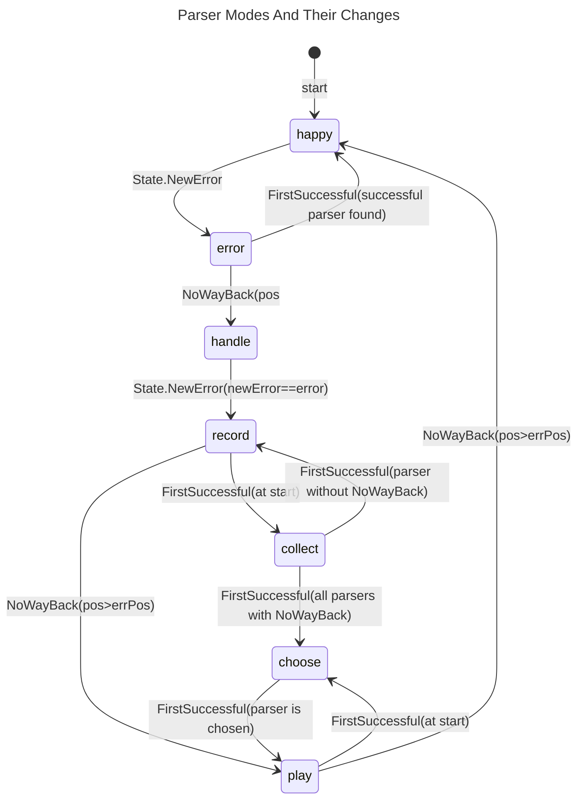

# Error Handling

Error handling consists of error reporting and recovering from errors.

## Error Reporting

Syntax errors are always reported in the form:
> expected "token" [line:column] source line incl. marker ▶ at error position

And semantic errors are always reported in the form:
> message [line:column] source line incl. marker ▶ at error position

So errors that don't start with `expected ` are no syntax errors.

## Recovering From Errors

For recovering from errors the parser can be in the following modes:

happy:
: Normal parsing discovering errors.
  This mode is also used for playing recorded parsers the nice way
  (after deleting some input).

error:
: An error was found but might be mitigated by backtracking.

handle:
: The error found has to be handled.
  We find the exact position and parser again.

record:
: The error has been found again. Now we record all parsers
  on the happy path from the erroring one to the next
  safe point (`NoWayBack`).
  In general the input doesn't matter in this mode and nothing is looked at or
  consumed.

collect:
: This is really a sub-mode of **_record_**.
  It's used by the `FirstSuccessful` parser to see if
  all of its sub-parsers contain a `NoWayBack` parser.
  In general the input doesn't matter in this mode and nothing is looked at or
  consumed.

play:
: In this mode the recorded parsers are executed up to the
  first `NoWayBack` parser whose sub-parser has a successful
  `Recoverer` with minimal waste.
  This really is the 'play hard' mode where errors are ignored, and we just
  want to reach the best `NoWayBack`.
  No actual parsing is to be done in this mode and no input should be consumed.

choose:
: This is really a sub-mode of **_play_**.
  It's used by the `FirstSuccessful` parser to find the
  sub-parser with minimal waste by its `Recoverer`.
  If multiple sub-parsers have the same minimal waste,
  the first of them will be chosen.
  As in **_play_** mode no actual parsing is to be done in this mode and
  no input should be consumed.

The relationships between the modes are shown in the following
state diagram.
The diagram also shows where a mode change can happen and the condition
(next to the mode) that has to be fulfilled for the change.
The position of the error is shortened to `errPos`.

The following sections document the details what the parsers or
methods performing the changes should do in each mode.

### Method State.NewError

happy:
: Create new error and switch to `mode=error`.

error:
: Register programming error.

handle:
: If `newError==error` then switch to `mode=record` else register programming error.

record:
: Ignore call (should not happen).

collect:
: Like mode **_record_**.

choose:
: Create new error.

play:
: Like mode **_choose_**.

### NoWayBack Parser

### FirstSuccessful Parser

happy:
: Returns result of first successful parser or after first `NoWayBack`.

error:
: Register programming error.

handle:
: Call sub-parsers until error is found again.

record:
: If `mode==record` at start then switch to `mode=collect` to find guaranteed
  `NoWayBack` and call **all** sub-parsers to 'collect' the ones with `NoWayBack`.
  (If they all have a `NoWayBack` then first try to play nice with removed input
  or else switch to `mode=choose`,
  call all sub-parsers again, choose the one with the least waste,
  switch to `mode=record` and finally call the chosen sub-parser again.
  Else switch back to `mode=record`, record itself and return.)
  Else return because the right sub-parser has already recorded itself.

collect:
: If `mode==collect` at start then call **all** sub-parsers to 'collect'
  the ones with `NoWayBack`.
  (If they all have a `NoWayBack` then return signaling guaranteed `NoWayBack`
  has been found.
  Else return signaling **no** guaranteed `NoWayBack` has been found.)
  Else register a programming error
  (the `mode==collect` must not escape the initiating parser and its sub-parsers).

choose:
: If `mode==choose` at start then call **all** sub-parsers to 'choose'
  the first one with the least amount of waste, returning signaling
  the minimal amount of waste found remembering the choice.
  Else register a programming error
  (the `mode==choose` must not escape the initiating parser and its sub-parsers).

play:
: If `mode==play` at start then call the remembered sub-parser and expect the
  mode changed to **_happy_** when the sub-parser returns.
  Else register a programming error
  (the **FirstSuccessful** parser doesn't record itself in this case).

### Other Parsers

happy:
: Normal parsing potentially calling `State.NewError`.

error (checked with State.Failed):
: Backtrack returning error.

handle:
: Like mode **_happy_**.

record:
: Records itself.

collect:
: Call sub-parser (if any) or do nothing.

choose:
: Like mode **_collect_**.

play:
: Call sub-parser (if any) and expect the mode changed to **_happy_** when
  the sub-parser returns, or do nothing.
