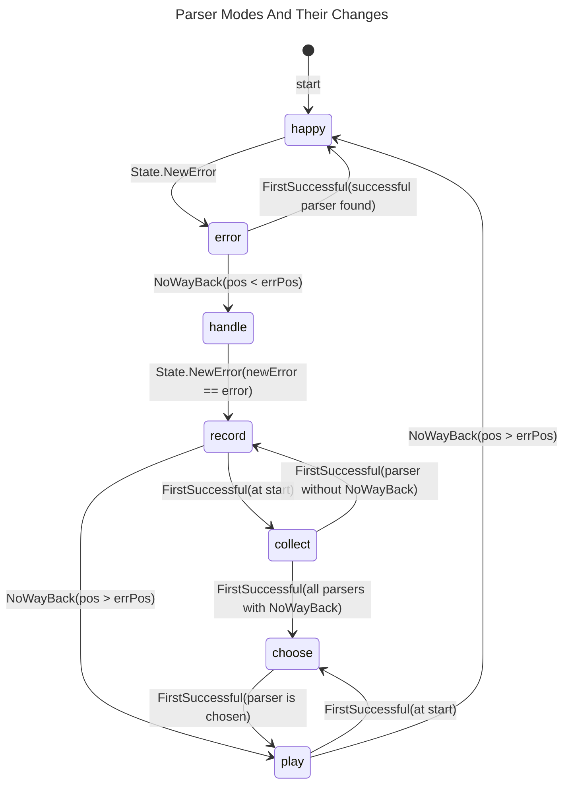

# Error Handling

The handling of (syntax) errors is the by far hardest part of this project.
I had to refactor the project **three** times to get it right and
almost made a PhD in computer science understanding all those
scientific papers about error handling in parsers
with their extremely concise notation that is explained nowhere
because it is the well known standard in the field.
Thank you, Sérgio Medeiros and Fabio Mascarenhas, for your paper
[Syntax Error Recovery in Parsing Expression Grammars](https://dl.acm.org/doi/10.1145/3167132.3167261).
That brought me on the right track.
And thank you, Terence Parr and [ANTLR](https://www.antlr.org/),
for an OpenSource parser to compare against.
I would have switched to it if I had found the Go support of ANTLR early enough.

So please take some time to understand this before making or suggesting
any major changes.

The error handling consists of error reporting and recovering from errors.

## Error Reporting

Syntax errors are always reported in the form:
> expected "token" [line:column] source line incl. marker ▶ at error position

Programming errors (in one of Your parsers) are always reported in the form:
> programming error: message [line:column] source line incl. marker ▶ at error position

Semantic and miscellaneous errors are always reported in the form:
> message [line:column] source line incl. marker ▶ at error position

Calculating the correct line and column of the error and setting the marker
correctly are the hardest problems here.
And they bring the most benefit to the user.

## Recovering From Errors

For recovering from errors the parser uses a couple of modes.
Fewer modes would only be possible by potentially much more wasted parsing.
Because we not only have to find a safe point to recover to but also have to
have the correct Go call stack to be able to parse correctly after recovering.
This is a downside of all parser combinators.
We mitigate it by recording all parsers on the way to the next safe state
(the next `NoWayBack` parser).

The `NoWayBack` parser plays a key role in error recovery.
It is the one to conclude that an error has indeed to be handled
(if its position is before the error),
and it also marks the next safe state to which we want to recover to
(if its position is behind the error).
A `NoWayBack` parser at the exact error position isn't of help
for that particular error.
Finally, the `NoWayBack` parser is used to prevent the `FirstSuccessful` parser
from trying other sub-parsers even in case of an error.

So please use the `NoWayBack` parser as much as reasonable for your grammar!
As it keeps the backtracking to a minimum, it also makes the parser perform better.

The following sections define the modes and their relationships in detail.

### Parser Modes

These are the modes:

##### happy:
Normal parsing discovering and reporting errors (with `State.NewError`).

##### error:
An error was found but might be mitigated by backtracking and the
`FirstSuccessful` parser.
In this mode the parser goes back to find last `NoWayBack` parser.
That might be hidden deep in a sub-parser that is earlier in sequence but
not on the Go call stack anymore.

So in this mode all parsers that use sub-parsers in sequence have to use them
in reverse order to find the right `NoWayBack`. \
Funnily this also applies to parsers that use the *same* sub-parser
multiple times. So if the second time the sub-parser was used, failed
then it might very well be that the first (successful) time it applied
a `NoWayBack` parser. At that would be the right one to find. \

Only the `FirstSuccessful` parser (not as parent parser but as sibling this time)
is different. It has to find the first successful sub-parser and its `NoWayBack`
again. \
As parent parser it can just return if the `NoWayBack` mark has been set.

##### handle:
We now know that the error found has to be handled.
We find the exact position and parser again by simply parsing one more time
in the new mode.

##### record:
The error has been found again. Now we record all parsers
on the happy path from the erroring one to the next
safe point (`NoWayBack`).
In general the input doesn't matter in this mode and nothing is looked at or
consumed.
The **record** mode and friends exist so we don't have to parse from far
back again and again. Because we would have to find a common ancestor of
the erroring parser and the recovering `NoWayBack` parser.
We want to try parsing a couple of times with some input deleted and
the waste would add up.

##### collect:
This is really a sub-mode of **record**.
It's used by the `FirstSuccessful` parser to see if
all of its sub-parsers contain a `NoWayBack` parser.
In general the input doesn't matter in this mode and nothing is looked at or
consumed.

This mode might not be necessary because we might add a method to the parser
interface to know this in advance.

##### play:
In this mode the recorded parsers are executed up to the
first `NoWayBack` parser whose sub-parser is successful.
Or the `Recoverer` with minimal waste is found.

Normal parsing should be done in this mode and input should be consumed.
But semantics might be missing, but we try to minimize it.
Since the whole recording is often played multiple times the semantics
shouldn't have side effects.

##### choose:
This is really a sub-mode of **play**.
It's used by the `FirstSuccessful` parser to find the
sub-parser with minimal waste by its `Recoverer`.
If multiple sub-parsers have the same minimal waste,
the first of them will be chosen.
As in **play** mode no actual parsing is to be done in this mode and
no input should be consumed.

### Relationships Between Modes

The relationships between the modes are shown in the following
state diagram.
The diagram also shows where a mode change can happen and the condition
(next to the mode) that has to be fulfilled for the change.
The position of the error is shortened to `errPos`.

The following sections document the details what the parsers or
methods mentioned above should do in each mode.

### Method `State.NewError`

##### happy:
Create new error and switch to `mode=error`.

##### error:
Register programming error.
  We must not error on the way back to the last `NoWayBack`.

##### handle:
If `newError==error` then switch to `mode=record` \
else register programming error. \
We must have missed either the erroring parser in `mode==happy` or
the error to handle just now in `mode==handle`.

##### record:
Ignore call (should not happen).
This would just cost a bit of performance and it thus no
programming error to be fixed.

##### collect:
Like mode **_record_**.

##### choose:
Create new error.

##### play:
Like mode **_choose_**.

### Parser `NoWayBack`

##### happy:
Set the `noWayBackMark` in the State if the sub-parser has been successful.
Else just return the error.

##### error:
Switch to `mode=handle` and if the error came from the sub-parser, call it again,
else return.

##### handle:
Call sub-parser to find the error again.
If the mode hasn't changed after the call, report a programming error because
this parser should be the one switching to `mode=handle` or we missed the error.

##### record:
If `mode==record` at the start then this is the safe place wanted to recover to.
Now recover. (Switch to `mode=play`.
Use `Deleter` to delete 1 to `maxDel` tokens and call all recorded parsers
in their order.
If no success just do the same without calling the very first
recorded parser (this simulates inserting correct input).
If still no success use the `Recoverer` to find the next safe spot in the input.
Move there, switch to `mode=happy` and resume normal parsing by calling the sub-parser.
This has to be successful (or we record a programming error).
Finally advance the `noWayBackMark` accordingly (like in `mode==happy`). )
Else just return (the sub-parser has already recorded itself).

##### collect:
Signal back to the `FirstSuccessful` parser that a `NoWayBack` parser was found
(including the `waste`?).

##### choose:
Signal the `waste` of the `Recoverer` back to the `FirstSuccessful` parser.

##### play:
If `mode==play` at the start then call sub-parser.
(If that is successful switch to `mode=happy` and clean up the error handling.
Else we have to return the error.)
Else register programming error since this parser wouldn't have recorded itself.

### Parser `FirstSuccessful`

##### happy:
Returns result of first successful parser or after first `NoWayBack`.

##### error:
Help finding the `NoWayBack` to switch over to `mode=handle`. \
It's the last one of the first successful sub-parser.

##### handle:
Call sub-parsers until error is found again.

##### record:
If `mode==record` at start then switch to `mode=collect` to find guaranteed
`NoWayBack` and call **all** sub-parsers to 'collect' the ones with `NoWayBack`.
(If they all have a `NoWayBack` then first try to play nice with removed input
or else switch to `mode=choose`,
call all sub-parsers again, choose the one with the least waste,
switch to `mode=record` and finally call the chosen sub-parser again.
Else switch back to `mode=record`, record itself and return.)
Else return because the right sub-parser has already recorded itself.

##### collect:
If `mode==collect` at start then call **all** sub-parsers to 'collect'
the ones with `NoWayBack`.
(If they all have a `NoWayBack` then return signaling guaranteed `NoWayBack`
has been found.
Else return signaling **no** guaranteed `NoWayBack` has been found.)
Else register a programming error
(the `mode==collect` must not escape the initiating parser and its sub-parsers).

##### choose:
If `mode==choose` at start then call **all** sub-parsers to 'choose'
the first one with the least amount of waste, returning signaling
the minimal amount of waste found remembering the choice.
Else register a programming error
(the `mode==choose` must not escape the initiating parser and its sub-parsers).

##### play:
If `mode==play` at start then call the remembered sub-parser and expect the
mode changed to **_happy_** when the sub-parser returns.
Else register a programming error
(the **FirstSuccessful** parser doesn't record itself in this case).

### Sequential Combining Parsers
These are all parsers that apply one or multiple sub-parsers in sequence.
##### happy:
Normal parsing potentially calling `State.NewError`.

##### error (checked with `State.Failed`):
Backtrack returning error.

##### handle:
Like mode **_happy_**.

##### record:
Records itself.

##### collect:
Call sub-parser (if any) or do nothing.

##### choose:
Like mode **_collect_**.

##### play:
Call sub-parser (if any) and expect the mode changed to **_happy_** when
the sub-parser returns, or do nothing.
