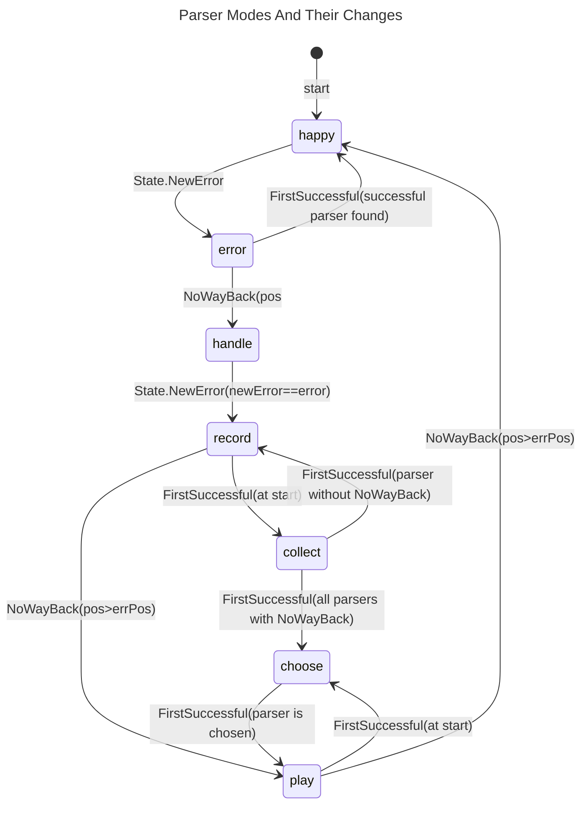

# Error Handling in ParComb

Error handling consists of error reporting and
recovering from errors in ParComb.

## Error Reporting

Syntax errors are always reported in the form:
> expected "token" [line:column] source line incl. marker ▶ at error position

And semantic errors are always reported in the form:
> message [line:column] source line incl. marker ▶ at error position

So errors that don't start with `expected ` are no syntax errors.

## Recovering From Errors

For recovering from errors the parser can be in the following modes:

happy
: Normal parsing discovering errors.

error
: An error was found but might be mitigated by backtracking.

handle
: The error found has to be handled.
  We find the exact position and parser again.

record
: The error has been found again. Now we record all parsers
  on the happy path from the erroring one to the next
  safe point (`NoWayBack`).

collect
: This is really a sub-mode of **_record_**.
  It's used by the `FirstSuccessful` parser to see if
  all of its sub-parsers contain a `NoWayBack` parser.

play
: In this mode the recorded parsers are executed up to the
  first `NoWayBack` parser whose sub-parser has a successful
  `Recoverer` with minimal waste.

choose
: This is really a sub-mode of **_play_**.
  It's used by the `FirstSuccessful` parser to find the
  sub-parser with minimal waste by its `Recoverer`.
  If multiple sub-parsers have the same minimal waste,
  the first of them will be chosen.

The relationships between the modes are shown in the following
state diagram.
The diagram also shows where a mode change can happen and the condition
(next to the mode) that has to be fulfilled for the change.
The position of the error is shortened to `errPos`.

The following table documents the details what the functions or
methods performing the changes should do in each mode.

|    Mode | State.NewError                      | NoWayBack | FirstSuccessful | Other Parsers   |
|--------:|:------------------------------------|:--------- |:--------------- |:----------------|
|   happy | create new error; mode=error        | | | normal parsing  |
|   error | keep error with max. pos            | | | backtrack       |
|  handle | if newError==error then mode=record | | | like happy      |
|  record | ignore call (should not happen)     | | | records itself  |
| collect | like record                         | | | call sub-parser |
|  choose | create new error                    | | | like collect    |
|    play | like choose                         | | | like happy      |

