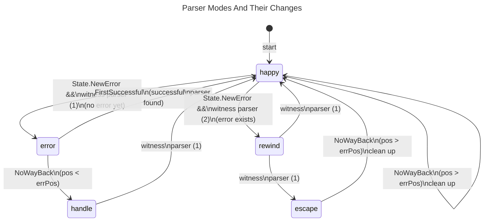

# Error Handling

The handling of (syntax) errors is the by far hardest part of this project.
I had to refactor the project **three** times to get it right and
almost made a PhD in computer science understanding all those
scientific papers about error handling in parsers
with their extremely concise notation that is explained nowhere
because it is the well known standard in the field.
Thank you, Sérgio Medeiros and Fabio Mascarenhas, for your paper
[Syntax Error Recovery in Parsing Expression Grammars](https://dl.acm.org/doi/10.1145/3167132.3167261).
That brought me on the right track.
And thank you, Terence Parr and [ANTLR](https://www.antlr.org/),
for an OpenSource parser to compare against.
I would have switched to it if I had found the Go support of ANTLR early enough.

So please take some time to understand this before making or suggesting
any major changes.

The error handling consists of error reporting and recovering from errors.

## Error Reporting

Syntax errors are always reported in the form:
> expected "token" [line:column] source line incl. marker ▶ at error position

Programming errors (in one of Your parsers) are always reported in the form:
> programming error: message [line:column] source line incl. marker ▶ at error position

Semantic and miscellaneous errors are always reported in the form:
> message [line:column] source line incl. marker ▶ at error position

Calculating the correct line and column of the error and setting the marker
correctly are the hardest problems here.
And they bring the most benefit to the user.

## Recovering From Errors

In general, we distinguish between simple **leaf** parsers that don't use
any sub-parsers and **branch** parsers that do use one or more sub-parsers.

For recovering from errors the parser uses a minimal set of modes. \
Great care has to be taken by all branch parsers because we not only
have to find a safe point to recover to, but also have to have the correct
Go call stack to be able to parse correctly after recovering.
Furthermore, we need to use the parsers more often than other (e.g. LR-) parsers. \
This is a downside of all parser combinators.
We mitigate it with some helpers and by caching as much as reasonable.

The `NoWayBack` parser plays a key role in error recovery.
It is the one to conclude that an error has indeed to be handled
(if its position is before the error),
and it also marks the next safe state to which we want to recover to
(if its position is behind the error). \
A `NoWayBack` parser at the exact error position isn't of help
for that particular error. \
Finally, the `NoWayBack` parser is used to prevent the `FirstSuccessful` parser
from trying other sub-parsers even in case of an error.
This way we prevent unnecessary backtracking.

So please use the `NoWayBack` parser as much as reasonable for your grammar!
As it keeps the backtracking to a minimum, it also makes the parser perform better.

The `FirstSuccessful` and `NoWayBack` parsers are special **branch** parsers.

The following sections define the modes and their relationships in detail.

### Parser Modes

These are the modes:

##### happy:
Normal parsing discovering and reporting errors
(with `State.NewError` or `State.ErrorAgain` for cached results). \
The error will be witnessed by the immediate parent branch parser.

If we happen to handle an error and hit a `NoWayBack` parser then
we will be very happy to clean up. \
This means we were able to handle the error by modifying the input
and didn't have to use any `Resolverer`.

##### error:
An error was found but might be mitigated by backtracking and the
`FirstSuccessful` parser.
In this mode the parser goes back to find last `NoWayBack` parser or
trying later alternatives in the `FirstSuccessful` parser.

The previous `NoWayBack` parser might be hidden deep in a sub-parser
that is earlier in sequence but not on the Go call stack anymore.

So in this mode all parsers that use sub-parsers in sequence have to use them
in reverse order to find the right `NoWayBack`. \
Funnily this also applies to parsers that use the *same* sub-parser
multiple times. So if the second time the sub-parser was used, failed
then it might very well be that the first (successful) time it applied
a `NoWayBack` parser. And that would be the right one to find.

Only the `FirstSuccessful` parser (not as parent parser but as sibling this time)
is different. It has to find the first successful sub-parser and its `NoWayBack`
again. \
As parent parser it can just return.

##### handle:
We now know that the error found has to be handled.
We find the exact position and witness parser again by simply parsing
one more time (forward) in the new mode (possibly omitting any semantics).

The witness parser should
1. modify the input (respecting `maxDel`),
2. switch to **happy** mode and
3. parse again (possibly omitting the failing parser).

##### rewind:
We failed again and have to try again with more deletion or
without using the parser that failed originally.

So we have to go backward similar to the **error** mode.
But with the distinction that we aren't looking for a `NoWayBack` parser
before the error position, but instead for the immediate parent branch parser of
the failing leaf parser that witnessed the error.

##### escape:
All deletion of input and inserting of good input didn't help.
Now we are out of options and can just escape this using a `Resolverer`.

So we find the best (least waste) `Resolverer` and its `NoWayBack` parser
executes it and finally cleans up and switches back to **happy** mode.

### Relationships Between Modes

The relationships between the modes are shown in the following
state diagram.
The diagram also shows where a mode change can happen and the condition
(next to the mode) that has to be fulfilled for the change.

The position of the error is shortened to `errPos`. \
The first parent branch parser to witness the error to be handled
is called 'witness parser (1)'. \
A possibly different parent branch parser to witness an error
during handling of the first is called 'witness parser (2)'.

```mermaid
  info
```



The following sections document the details what the parsers or
methods mentioned above should do in each mode.

### Method `State.NewError`

##### happy:
Create new error and switch to `mode=error`.

##### error:
Ignore. \
This can happen in an alternative branch that wasn't used because of
a better error further in the input in a later branch. \
With proper caching in place we can turn this into a programming error.

##### handle:
If `newError==error` then switch to `mode=record` \
else register programming error. \
We must have missed either the erroring parser in `mode==happy` or
the error to handle just now in `mode==handle`.

##### record:
Ignore call (should not happen).
This would just cost a bit of performance and it thus no
programming error to be fixed.

##### collect:
Like mode **_record_**.

##### choose:
Create new error.

##### play:
Like mode **_choose_**.

### Parser `NoWayBack`

##### happy:
Set the `noWayBackMark` in the State if the sub-parser has been successful.
Else just return the error.

##### error:
Switch to `mode=handle` and return.

##### handle:
Call sub-parser to find the error again.
If the mode hasn't changed to `record` after the call,
report a programming error because
this parser should have been the one switching to `mode=handle` or
we missed the error.

##### record:
If `mode==record` at the start then this is the safe place wanted to recover to.
Now recover. (Switch to `mode=play`.
Use `Deleter` to delete 1 to `maxDel` tokens and call all recorded parsers
in their order.
If no success just do the same without calling the very first
recorded parser (this simulates inserting correct input).
If still no success use the `Recoverer` to find the next safe spot in the input.
Move there, switch to `mode=happy` and resume normal parsing by calling the sub-parser.
This has to be successful (or we record a programming error).
Finally advance the `noWayBackMark` accordingly (like in `mode==happy`). )
Else just return (the sub-parser has already recorded itself).

##### collect:
Signal back to the `FirstSuccessful` parser that a `NoWayBack` parser was found
(including the `waste`?).

##### choose:
Signal the `waste` of the `Recoverer` back to the `FirstSuccessful` parser.

##### play:
If `mode==play` at the start then call sub-parser.
(If that is successful switch to `mode=happy` and clean up the error handling.
Else we have to return the error.)
Else register programming error since this parser wouldn't have recorded itself.

### Parser `FirstSuccessful`

##### happy:
Returns result of first successful parser or after first `NoWayBack`.

##### error:
Help finding the `NoWayBack` to switch over to `mode=handle`. \
It's the last one of the first successful sub-parser.
We know the right sub-parser from the cache and only call it if it failed.

##### handle:
Call sub-parsers until error is found again. \
We know the right sub-parser from the cache and only call it if it failed.


##### record:
If `mode==record` at start then switch to `mode=collect` to find guaranteed
`NoWayBack` and call **all** sub-parsers to 'collect' the ones with `NoWayBack`.
(If they all have a `NoWayBack` then first try to play nice with removed input
or else switch to `mode=choose`,
call all sub-parsers again, choose the one with the least waste,
switch to `mode=record` and finally call the chosen sub-parser again.
Else switch back to `mode=record`, record itself and return.)
Else return because the right sub-parser has already recorded itself.

##### collect:
If `mode==collect` at start then call **all** sub-parsers to 'collect'
the ones with `NoWayBack`.
(If they all have a `NoWayBack` then return signaling guaranteed `NoWayBack`
has been found.
Else return signaling **no** guaranteed `NoWayBack` has been found.)
Else register a programming error
(the `mode==collect` must not escape the initiating parser and its sub-parsers).

##### choose:
If `mode==choose` at start then call **all** sub-parsers to 'choose'
the first one with the least amount of waste, returning signaling
the minimal amount of waste found remembering the choice.
Else register a programming error
(the `mode==choose` must not escape the initiating parser and its sub-parsers).

##### play:
If `mode==play` at start then call the remembered sub-parser and expect the
mode changed to **_happy_** when the sub-parser returns.
Else register a programming error
(the **FirstSuccessful** parser doesn't record itself in this case).

### Branch Parsers (Sequential Combining Parsers)
These are all parsers that apply one or multiple sub-parsers in sequence.
They have got the obligation to witness and handle any error happening
in any of their sub-parsers.

So creating a **branch** parser is much more involved than creating a
**leaf** parser.

##### happy:
Normal parsing potentially witnessing an error and reporting oneself as
witness (using `State.IWitnessed`).

##### error (checked with `State.Failed`):
Use the parsers (that succeeded already) in reverse order to find the last one
with a `NoWayBack` parser that moved the mark. (Please cache this!) \
Return including the error if none could be found.

##### handle:
If the parser witnessed the current error at the current input position
(checked with `State.AmIWitness`) it has to switch to `mode=happy`.

##### record:
Records itself.

##### collect:
Call sub-parser (if any) or do nothing.

##### choose:
Like mode **collect**.

##### play:
Call sub-parser (if any) and expect the mode changed to **happy** when
the sub-parser returns, or do nothing.

### Leaf Parsers

All parsers that don't have any sub-parsers simply do their thing and
possibly call `State.NewError`.
They don't have to care about `mode`s at all. :)
But they can use `State.Semantic` to possibly skip costly semantics.

## Limits

There are some very academic cases that are intentionally not supported by this project:

- The same `FirstSuccessful` parser is used in a cascade more than 8 times
  without any `NoWayBack` parser in between. \
  It is absolutely possible to support this case. \
  But it would drive up the complexity of the `FirstSuccessful` parser.
  And that is one of the most complex parts of the code already.